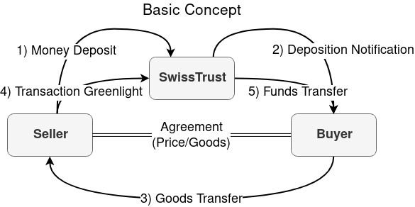

  
*Basic Workflow*

# Commands
## Create Deposit
Send agreed amount of money to team switzerland.
The following message syntax lets us know, that you want make a deposit.
```bash
@swisstrust deposit <receiving team>
```
## Greenlight Deposit
Let's us know, that the goods you recieved are ok and we should send the money to the receiving team.
```bash
@swisstrust greenlight <transaction id>
```
## Cancel Deposit
If both teams decide to cancel the transaction, they should both initiate this command. The sending team will then get their money back.
```bash
@swisstrust cancel <transaction id>
```
## Escalate Deposit
If there are any problems type this command. The transaction will be locked and we will review the case by hand. Please send us the traded goods for review!
```bash
@swisstrust escalate <transaction id>
```
# Important information
* Use the teams username when creating the deposit; not the teams display name. You can find the teams username on the scoreboard (the one in parenthesis)
* Make sure you write the command for deposit creation correct! Otherwise we just get your money without our bot creating a deposit for you; nobody wants that to happen.
* Once a deposit has been escalated, it cannot be greenlit or canceled anymore
* The transaction fee is 1% of the deposited amount, but at least 10€. Keep this in mind when dealing out the price with a team.
* If there is a problem, just contact us. We will try to resolve the error. If the error was due to us, your transaction will be free.
* When a transaction has been escalated, both the sending and the receiving team should send their goods to team Switzerland. This should be done for two reasons: first, we have to check if the sent goods match up (otherwise one team could claim it has received something unusable, when the sending team actually sent something good). Second, we need to make sure what the sending team sent is actually of good quality. If one team refuses to send its goods, or the goods do not fulfill expectations, we will decide what is done with the money (we can split it, pay it back, pay it to the sender or just keep it altogether)

# Example Transactions

## Successful
|Team A|Swisstrust|Team B|
|------|----------|------|
|Sends 100€ to Swisstrust with message ‘@swisstrust deposit B’|||
||Confirms deposit to Team A and tells transaction id = 1337. Notifies Team B about deposited amount||
|||Sends goods to team A|
|Sends ‘@swisstrust greenlight 1337’|||
||Confirms successful transaction to Team A. Sends 90€ to Team B|||

## Canceled
|Team A|Swisstrust|Team B|
|------|----------|------|
|Sends 100€ to Swisstrust with message ‘@swisstrust deposit B’|||
||Confirms deposit to Team A and tells transaction id = 1337. Notifies Team B about deposited amount||
|||Is no longer willing to send goods, sends message ‘@swisstrust cancel 1337’|
|Sends ‘@swisstrust cancel 1337’|||
||Confirms cancelation to both teams. Sends 100€ to Team A|||

## Escalated
|Team A|Swisstrust|Team B|
|------|----------|------|
|Sends 100€ to Swisstrust with message ‘@swisstrust deposit B’|||
||Confirms deposit to Team A and tells transaction id = 1337. Notifies Team B about deposited amount||
|||Sends goods to team A|
|Does not agree with sent goods from Team B. Sends ‘@swisstrust escalate 1337’|||
||Confirms escalation to both teams. Team Switzerland will review your case and help in deciding a fair solution|||
